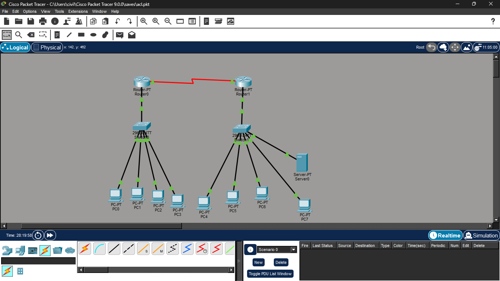
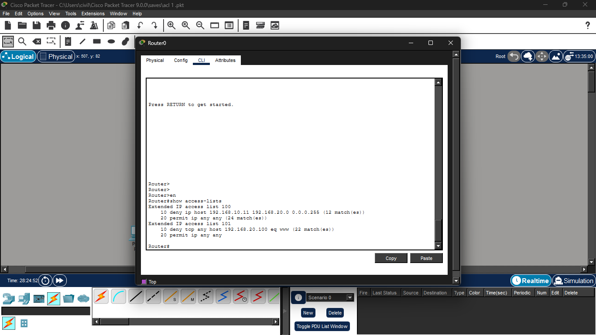
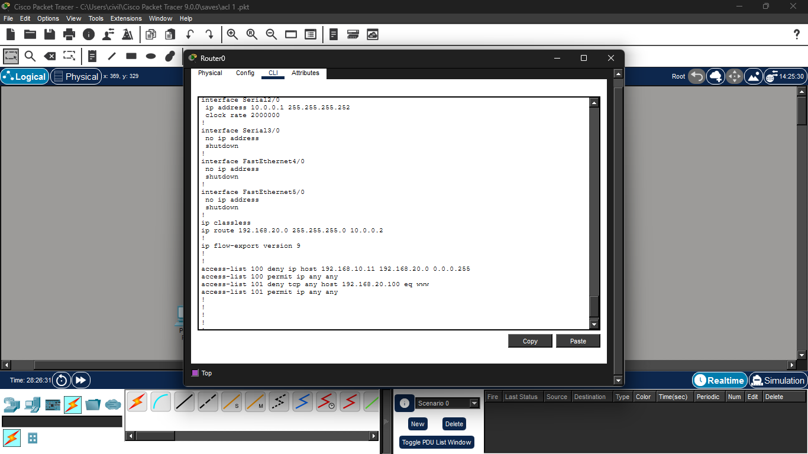
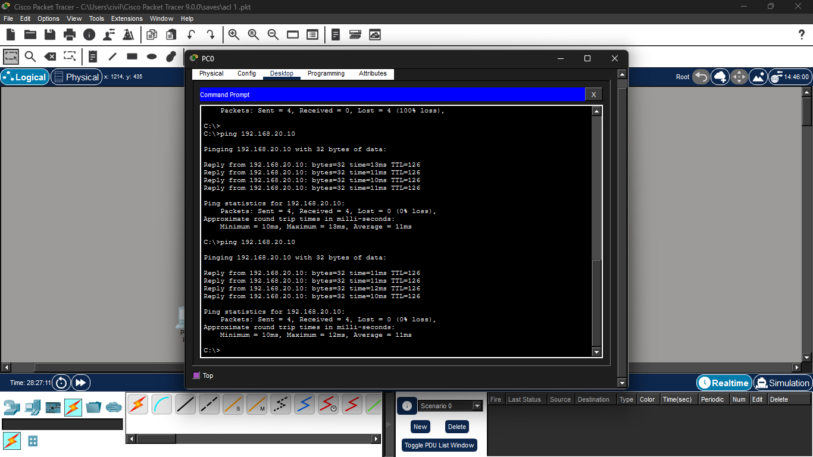
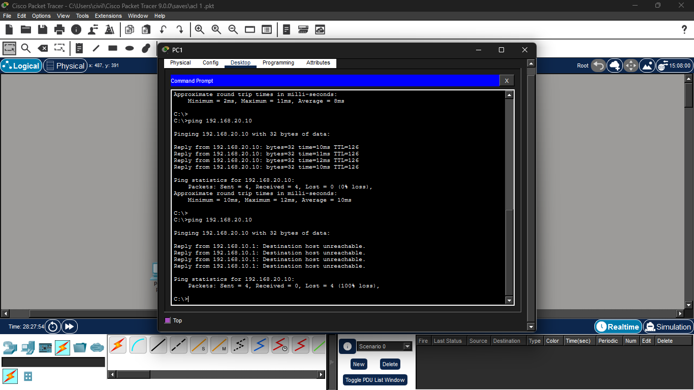
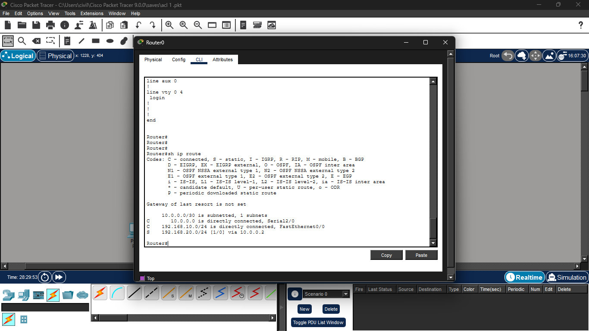

# Cisco Extended ACL Implementation

## Project Overview
This project demonstrates how to configure and verify an Extended Access Control List (ACL) using Cisco Packet Tracer. The ACL is used to control HTTP access between two networks while allowing other permitted traffic.

## Objectives
- Configure an Extended ACL.
- Allow authorized hosts to access the server.
- Block unauthorized hosts from accessing the web server.
- Verify ACL operation using ping and HTTP tests.

## Topology



## IP Addressing

| Device | IP Address |
|---------|------------|
| PC0 | 192.168.10.10 |
| PC1 | 192.168.10.11 |
| Server | 192.168.20.100 |
| Router0 LAN | 192.168.10.1 |
| Router1 LAN | 192.168.20.1 |

## ACL Configuration

```text
access-list 101 deny tcp host 192.168.10.11 host 192.168.20.100 eq 80
access-list 101 permit ip any any
```

Applied on the LAN interface of Router0:

```text
interface FastEthernet0/0
ip access-group 101 in
```

## Verification

### ACL Configuration



### ACL Applied to Interface



### Allowed Host



### Blocked Host



### Routing Table



## Skills Learned

- Cisco Packet Tracer
- Extended ACL Configuration
- Network Security
- Router Configuration
- Traffic Filtering
- Network Verification

## Author

**Asawari Kale**
